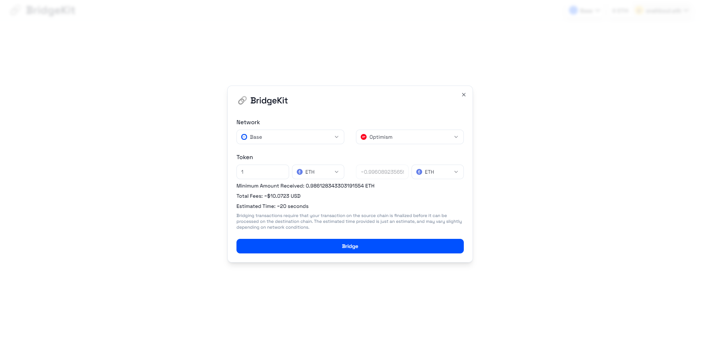

# 🔗 BridgeKit

**The easiest way to build multichain dApps**

Plug-and-play React library to offer in-app cross-chain bridging and swaps to your dApp.

- 🔥 One line to add bridging support
- ✅ Go from any token to any token
- 🦄 Built with [wagmi](https://wagmi.sh/) and [viem](https://viem.sh/)

## Try it out!

Try out a sample app [here](https://bridgekit-example.vercel.app/)

## Quick Start

Setting up BridgeKit in your project is easy - especially if you're already using [RainbowKit](https://www.rainbowkit.com/)!

### Install Packages

```sh
npm install bridgekit wagmi viem
# or
yarn add bridgekit wagmi viem
# or
pnpm add bridgekit wagmi viem
```

### Set up Providers (optional)

If you aren't already using [RainbowKit](https://www.rainbowkit.com/) and/or [Wagmi](https://wagmi.sh/) - set up a `WagmiConfig` in your application:

[Read more on how to set up a WagmiConfig Provider](https://wagmi.sh/react/getting-started)

### Import BridgeButton

Import the `BridgeButton` component and the required CSS styles

```tsx
"use client";

import "bridgekit/styles.css";
import { BridgeButton } from "bridgekit";

export default function YourComponent() {
  // ... Your Code

  return (
    // ...
    <BridgeButton />
    // ...
  );
}
```

aaaand that's it!

## License

BridgeKit is licensed under the MIT License. See [LICENSE](./LICENSE) for more information.

## Acknowledgements

- [Axelar](https://axelar.network/) for the cross-chain GMP infrastructure that makes this all possible!
- [Squid Router](https://www.squidrouter.com/) for cross-chain swapping infrastructure using Axelar
- [RainbowKit](https://www.rainbowkit.com/) for inspiration of great in-app plug-and-play experiences
- [shadcn/ui](https://ui.shadcn.com/) for the styling and components!
- Matthew Bunday for the original idea and the name!
